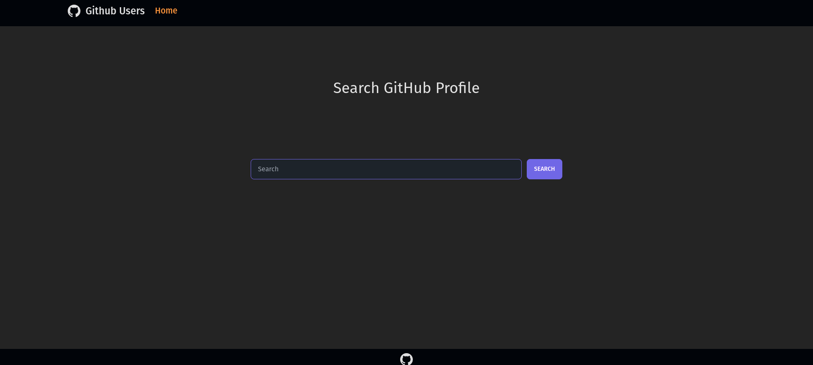
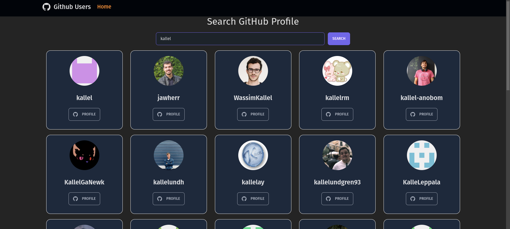

#  React GitHub Users Search

### O aplicativo de pesquisa de repositório que usa API de [Github's repository search API](https://docs.github.com/en/rest/reference/search#search-repositories) que exibi os resultados com a base do termo de pesquisa

## Demo

- Heroku: https://reactreposearch.herokuapp.com/

## Setup

To run this project, install it locally using npm:

```
$ npm install
$ npm dev
```


## Technologies

Project is created with:
- Vite
- React
- Javascript

## Components

- Footer
- Header
- Loader
- RepoCard

## Resources

- Favicon: https://favicon.io/emoji-favicons/face-with-monocle
- React Icons: https://react-icons.github.io/react-icons/
- tailwind: https://tailwindcss.com/
- React DaisyUI: https://react.daisyui.com/
## Screenshots

<table>
  <tr>
    <tr>
    <th>Desktop</th>
    </tr>
  </tr>
    <td> </td>
    <td></td>
   </tr> 
       <tr>
    <th>Mobile</th>
    </tr>
   <tr>
    <td></td>
  </td>
  </tr>
</table>
